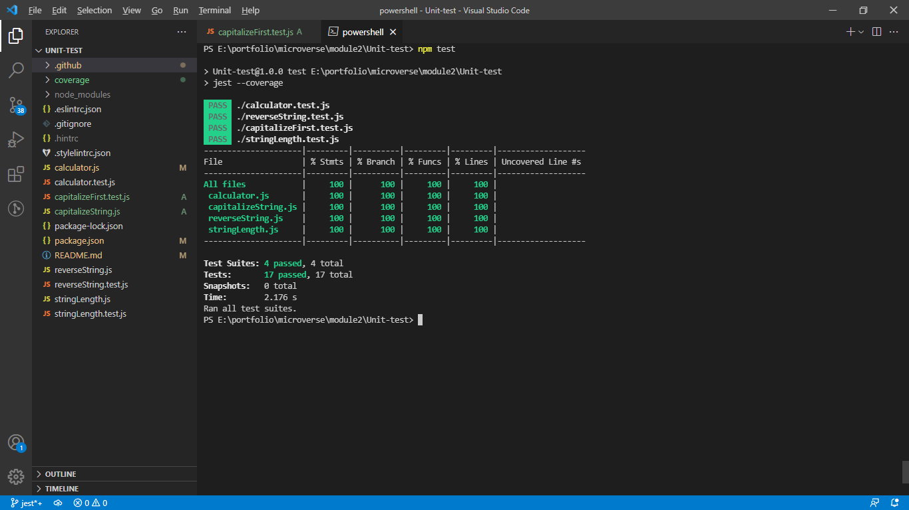

# Unit testing using Jest library

> The purpose of creating thic repository is write a few practical tests for JavaScript functions using the Jest library.
# Screenshot

# Built With

- JAVASCRIPT
- Jest library

# Getting started

## To get a local copy of this repository and run tests kindly follow the steps below.
- In your local PC, open your terminal or command prompt in the folder you would like to clone this repository into
- Make sure you have `Node NPM` installed on your computer
- Clone or download this repo on your machine: `git clone https://github.com/Unit-test.git`
- Enter project directory with command `cd Unit-test`
- Run tests with command `npm test`

# Author
:bust_in_silhouette: Tolibjon Tolibov
- GitHub: [@toliboff](https://https://github.com/toliboff)
- Twitter: [@tolib_tolibov](https://twitter.com/tolib_tolibov)
- LinkedIn: [Tolibjon](https://linkedin.com/in/tolibjon-tolibov)

# Contributing
Contributions, issues, and feature requests are welcome!

Feel free to check the [issues page.](https://github.com/toliboff/Unit-test/issues)

# Show your support
Give a :star: if you like this project!

* [Jest](https://jestjs.io/)
* [GitHub](https://www.github.com)
* [Microverse](https://microverse.org)